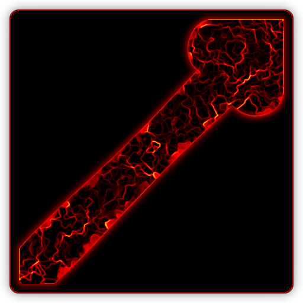

# DesktopGen

Generate Linux .desktop shortcut files from the command line.

 

- [DesktopGen](#desktopgen)
  - [Description](#description)
  - [Installation](#installation)
    - [Portable](#portable)
    - [Debian Package Installer](#debian-package-installer)
  - [Usage](#usage)
    - [Examples](#examples)
      - [Create program shortcut](#create-program-shortcut)
      - [Help Screen](#help-screen)
    - [Bash Completion](#bash-completion)
  - [Project Information](#project-information)
    - [File Information](#file-information)
    - [MD5](#md5)
  - [Media](#media)

---

## Description

This is a tool written in *C++* that helps me quickly create *Linux* `.desktop` shortcut files from the command line. 

If you are not familiar with these files they are Linux application/command line **shortcut** files just like you find in Windows or many other operating systems.

This generates a basic template with a few defaults and parameter/arguments for the most common *Entries* that many find in a *.desktop file* and is not meant to have an extensive list of paramters for every *Entry* under the sun. Having said that you can circumvent this and add any additional *Entries* you want by simply appending some formatted text of the *Entries* you want with one of the pre-existing parameters.
For example:

```Bash
 $ desktopgen --file fakeshortcut --icon "$(echo -e \\nFakeKey=FakeValue)"
 $ cat fakeshortcut.desktop
[Desktop Entry]
Name=
GenericName=
Comment=
Exec=
Terminal=false
Type=Application
Icon=
FakeKey=FakeValue
Categories=GNOME;GTK;Utility;
```

will add the new Key/Value pair in after the Icon *Entry* with the `\\n` new line. You can still set the Icon (or whatever parameter) by adding the text before the new line. In this way you preformat your added values in a variable/array and append anything you want. You can override any default by it's corresponding parameter.

More information about *.desktop* files and *Entries*,*Categories* etc... can be found here: [[FreeDesktop Specifications](https://specifications.freedesktop.org/desktop-entry-spec/latest/)]

I do most things from the command line if possible, but I'm working on a little *YAD*/*Zenity* UI, but I might make a GTK gui for it in the near future. I have lots of other projects and to work on, but this project was spawned from inspiration and necessity and so other things had to wait while I wrote this first, but I'm not sure when I'll get around to a real UI. There are other methods to create shortcuts,  but this is my method.

---

## Installation

This is a single binary executable built on and for 64 bit Linux machines and here I have provided several methods of use and installation. All files are found in the [Releases](https://github.com/Lateralus138/desktopgen/releases) section.

### Portable

A single compiled binary executable is provided unless you want to download the source and build it yourself. This file's name is ***`desktopgen`***.


### Debian Package Installer

I have provided a *.deb* package installer that contains teh program, bash completion, and icons that will be removed upon un-installing. Sorry, I do not have a PPA yet, though I have started the process. This file's name is ***`desktopgen.deb`***.

---

## Usage

As stated above this is a command line utility for *Linux* shells/terminals/consoles/whatever/etc... And also, as stated above, this could work well with a YAD/Zenity GUI.

### Examples

#### Create program shortcut

```Bash
 $ desktopgen \
 > --path ~/.local/share/applications \
 > --file ProgramName \
 > --name "Program Name" \
 > --generic "ProgramName" \
 > --comment "Program Name does something" \
 > --exec "/path/to/programname" \
 > --icon "/path/or/name/of/icon"
 $ cat ~/.local/share/applications/Programname.desktop
[Desktop Entry]
Name=Program Name
GenericName=ProgramName
Comment=Program Name does something
Exec=/path/to/programname
Terminal=false
Type=Application
Icon=/path/or/name/of/icon
Categories=GNOME;GTK;Utility;
```

#### Help Screen

```Bash
 $ desktopgen --help

  'desktopgen' - Generate .desktop shortcut files  
  from the command line.                          

  USAGE: desktopgen [OPTIONS]...                  

  OPTIONS:                                        
    -h,--help       This help screen.             
    -p,--path       Directory of the new file.    
    -f,--file       The name of the file without  
                    the .desktop extension. This  
                    parameter has to be provided. 
    -m,--monochrome Remove color from all output. 
    -q,--quiet      All errors are non-verbose.   
    -n,--name       [Name] string entry.          
    -g,--generic    [GenericName] string entry.   
    -c,--comment    [Comment] string entry.       
    -e,--exec       [Exec] string entry.          
    -T,--terminal   [Terminal] string entry.      
    -t,--type       [Type] string entry.          
    -i,--icon       [Icon] string entry.          
    -C,--categories [Categories] string entry.    

```

### Bash Completion

Bash completion can be provided either by installing with the *.deb* installer or found [here](./debian/usr/share/bash-completion/completions/desktopgen).

---

## Project Information

This project is written in `C++`.

[![C++](https://img.shields.io/endpoint?url=https://raw.githubusercontent.com/Lateralus138/desktopgen/master/docs/json/cpp.json&logo=data%3Aimage%2Fpng%3Bbase64%2CiVBORw0KGgoAAAANSUhEUgAAABAAAAAQCAMAAAAoLQ9TAAAABGdBTUEAALGPC%2FxhBQAAACBjSFJNAAB6JgAAgIQAAPoAAACA6AAAdTAAAOpgAAA6mAAAF3CculE8AAABcVBMVEUAAAAAgM0Af8wolNQAa7YAbbkAQIcAQIYAVJ0AgM0AgM0AgM0AgM0AgM0AgM0AgM0AgM0AgM0AgM0Af8wAfswAfswAf8wAgM0AgM0AgM0Af80AgM0AgM0AgM0AgM0Af8wAgM0Af80djtIIg84Af8wAfsxYrN4Fg84Gg85RqNwej9MLhM8LhM8AfcsAgM0Hg88AfsshkNNTqd1%2Fv%2BUXi9AHdsAAYKoAY64ih8kAf81YkcEFV54GV55Sj8EnlNULhc8AecYdebwKcrsAe8gAb7oAXacAXqgAcLwAImUAUpoAVJ0AUpwAUZoAIWMAVJ0AVJ0AUpwAUZwAVJ0AVJ0AVJ0AVJ0AgM0cjtJqteGczetqtOEAf807ndjL5fT9%2Fv7%2F%2F%2F%2FM5fQ9ntnu9vu12vCi0Oz%2F%2F%2F6Hw%2Bebzeufz%2Bx%2Bv%2BW12e%2Bgz%2BxqteLu9fmRx%2BjL3Ovu8%2Fi1zeKrzeUAUpw7e7M8fLQAU50cZ6hqm8WcvNgAVJ3xWY3ZAAAAVnRSTlMAAAAAAAAAAAAREApTvrxRCQQ9rfX0qwErleyUKjncOFv%2B%2Fv5b%2Ff7%2B%2Fv7%2B%2Fv1b%2Ff7%2B%2Fv7%2BW%2F7%2B%2Fv79%2Fv7%2B%2Fv7%2B%2Fv7%2B%2Fjfa2jcBKJHqKAEEO6r0CVC8EFaOox4AAAABYktHRF9z0VEtAAAACXBIWXMAAA7DAAAOwwHHb6hkAAAAB3RJTUUH5QYKDQws%2FBWF6QAAAONJREFUGNNjYAABRkZOLkZGBhhgZOTm4eXjF4AJMQoKCYuEhYmKCQmCRBjFJSSlwiMiI6PCpaRlxBkZGGXlomNi4%2BLj4xISo%2BXkgQIKikqx8UnJyUnxKcqKKiAB1ajUJDV1Dc00LW0dXSaggF56fLK%2BgYFhhlGmsQkzRCDL1MzcIhsmYJkTn2tlbWObZ2cP0sKk4OCYH19QWFgQX%2BTkrMLEwOLiWlySD7I2v7TMzZ2Vgc3D08u7vKKysqLc28vHlx3oVg4%2F%2F4DAqqrAAH8%2FDohnODiCgkNCgoM4OOD%2B5eAIDYVyAZ9mMF8DmkLwAAAAJXRFWHRkYXRlOmNyZWF0ZQAyMDIxLTA2LTEwVDE4OjEyOjQ0LTA1OjAwkjvGQgAAACV0RVh0ZGF0ZTptb2RpZnkAMjAyMS0wNi0xMFQxODoxMjo0NC0wNTowMONmfv4AAAAASUVORK5CYII%3D)](http://www.cplusplus.org/)


|Description|Status|
|:---:|:---:|
|CodeFactor Grade||
|Project Release Date||
|Total downloads for this project||
|Complete repository size||
|Commits in last month||
|Commits in last year||

Latest Version Status

|Description|Status|Number of Downloads|
|:---:|:---:|:---:|
|Latest Release version|||
|Latest Tag version, possible Pre-Release's|||

### File Information

All current compiled files and the source of this project can be found at this repository in the **`Releases`** section under **`Stable Release`**.

***This is the recommended method of download.***

[![CR](https://img.shields.io/endpoint?url=https://raw.githubusercontent.com/Lateralus138/desktopgen/master/docs/json/current_releases.json&logo=data%3Aimage%2Fpng%3Bbase64%2CiVBORw0KGgoAAAANSUhEUgAAABAAAAAQCAMAAAAoLQ9TAAAABGdBTUEAALGPC%2FxhBQAAACBjSFJNAAB6JgAAgIQAAPoAAACA6AAAdTAAAOpgAAA6mAAAF3CculE8AAABcVBMVEUAAAAAgM0Af8wolNQAa7YAbbkAQIcAQIYAVJ0AgM0AgM0AgM0AgM0AgM0AgM0AgM0AgM0AgM0AgM0Af8wAfswAfswAf8wAgM0AgM0AgM0Af80AgM0AgM0AgM0AgM0Af8wAgM0Af80djtIIg84Af8wAfsxYrN4Fg84Gg85RqNwej9MLhM8LhM8AfcsAgM0Hg88AfsshkNNTqd1%2Fv%2BUXi9AHdsAAYKoAY64ih8kAf81YkcEFV54GV55Sj8EnlNULhc8AecYdebwKcrsAe8gAb7oAXacAXqgAcLwAImUAUpoAVJ0AUpwAUZoAIWMAVJ0AVJ0AUpwAUZwAVJ0AVJ0AVJ0AVJ0AgM0cjtJqteGczetqtOEAf807ndjL5fT9%2Fv7%2F%2F%2F%2FM5fQ9ntnu9vu12vCi0Oz%2F%2F%2F6Hw%2Bebzeufz%2Bx%2Bv%2BW12e%2Bgz%2BxqteLu9fmRx%2BjL3Ovu8%2Fi1zeKrzeUAUpw7e7M8fLQAU50cZ6hqm8WcvNgAVJ3xWY3ZAAAAVnRSTlMAAAAAAAAAAAAREApTvrxRCQQ9rfX0qwErleyUKjncOFv%2B%2Fv5b%2Ff7%2B%2Fv7%2B%2Fv1b%2Ff7%2B%2Fv7%2BW%2F7%2B%2Fv79%2Fv7%2B%2Fv7%2B%2Fv7%2B%2Fjfa2jcBKJHqKAEEO6r0CVC8EFaOox4AAAABYktHRF9z0VEtAAAACXBIWXMAAA7DAAAOwwHHb6hkAAAAB3RJTUUH5QYKDQws%2FBWF6QAAAONJREFUGNNjYAABRkZOLkZGBhhgZOTm4eXjF4AJMQoKCYuEhYmKCQmCRBjFJSSlwiMiI6PCpaRlxBkZGGXlomNi4%2BLj4xISo%2BXkgQIKikqx8UnJyUnxKcqKKiAB1ajUJDV1Dc00LW0dXSaggF56fLK%2BgYFhhlGmsQkzRCDL1MzcIhsmYJkTn2tlbWObZ2cP0sKk4OCYH19QWFgQX%2BTkrMLEwOLiWlySD7I2v7TMzZ2Vgc3D08u7vKKysqLc28vHlx3oVg4%2F%2F4DAqqrAAH8%2FDohnODiCgkNCgoM4OOD%2B5eAIDYVyAZ9mMF8DmkLwAAAAJXRFWHRkYXRlOmNyZWF0ZQAyMDIxLTA2LTEwVDE4OjEyOjQ0LTA1OjAwkjvGQgAAACV0RVh0ZGF0ZTptb2RpZnkAMjAyMS0wNi0xMFQxODoxMjo0NC0wNTowMONmfv4AAAAASUVORK5CYII%3D)](https://github.com/Lateralus138/desktopgen/releases/tag/1.0.0)

You can, of course, build, fork, and/or download the source of this project as per the [LICENSE](./LICENSE) of this project. If you want me to create a build for a different architecture and don't want to do it yourself then just let me know what you need and I'll look into it.

### MD5

These MD5 values are evaluated immediately after the build.

Linux MD5


Debian MD5


---

## Media

Logo


Help Screen

